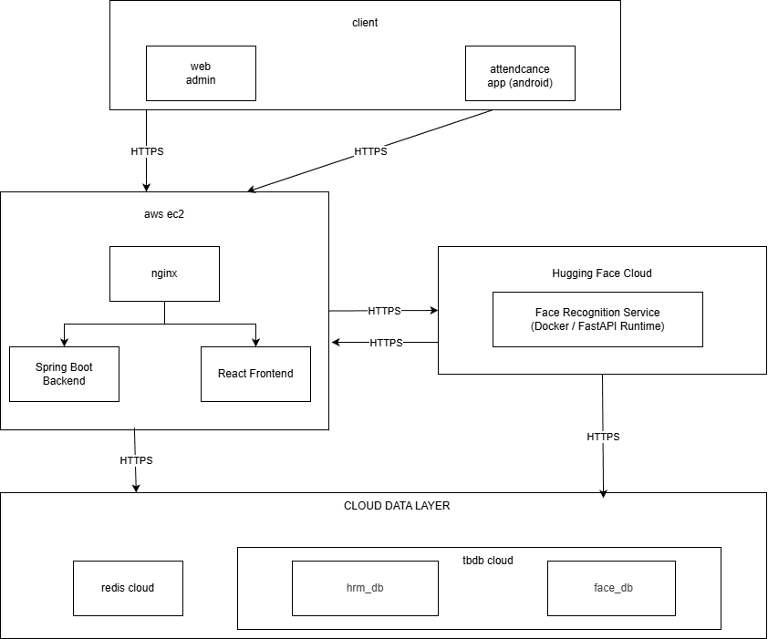
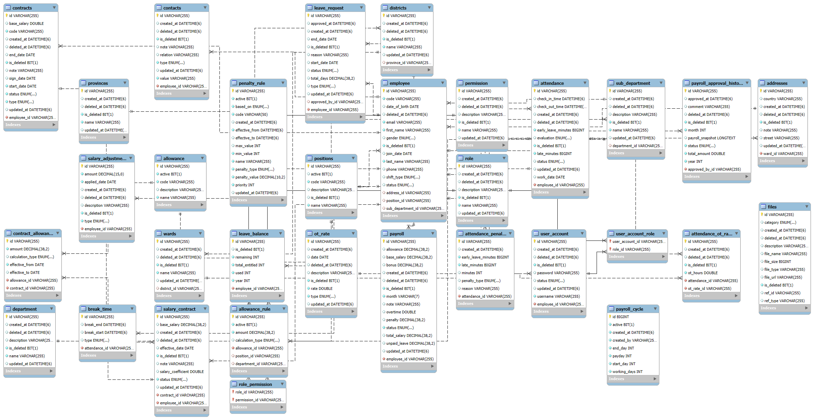

# 🤖 AI Face Recognition Attendance System

Full-stack attendance management system using AI-powered face recognition  
Microservice-based architecture with secure JWT authentication and cloud deployment.

---

## 📌 Overview

This project is a production-style attendance management system that integrates:

- AI face recognition service (HuggingFace + Python)
- Spring Boot backend API
- React admin dashboard
- Android mobile application
- Cloud database & Redis token storage

The system separates business logic and biometric processing into independent services for scalability and maintainability.

---
## 🌍 Live Demo

🔗 Web Admin: https://hrm-db.duckdns.org/

Test account:
- Username: admin
- Password: admin

---
## 🏗 Architecture

### Main Components

- **Spring Boot Backend** – Business logic & REST API  
- **Face Recognition Service (Python + HuggingFace)** – Embedding extraction & employee identification  
- **TiDB Cloud** – Business data  
- **MySQL (Face DB)** – Face embeddings storage  
- **Redis Cloud** – Token management  
- **React Admin Panel** – Management UI  
- **Android App** – Employee attendance client  

---

## 🔄 Attendance Flow

1. Employee captures face image (Android App)
2. Image → Backend API (HTTPS)
3. Backend → Face Recognition Service
4. AI extracts embedding & identifies employee
5. Employee ID returned to backend
6. Backend validates & records attendance

---

## 🔐 Security Design

- JWT Authentication (Access + Refresh Token)
- Role-Based Access Control (RBAC)
- Refresh Token stored in Redis
- HTTPS communication between services
- Separate biometric database for security isolation

---

## 🗄 Database Design

Core entities:

- employee
- attendance
- payroll
- leave_request
- department
- user_account

---

## 🚀 Key Features

- AI-powered face recognition attendance
- Microservice-style architecture
- Secure JWT authentication system
- Redis-based token management
- Dockerized services
- Cloud-ready deployment (AWS EC2)
- Separate AI biometric storage

---

## 🛠 Tech Stack

**Backend:** Spring Boot, Spring Security, JWT, Redis  
**AI Service:** Python, FastAPI, HuggingFace, Docker  
**Database:** TiDB Cloud, MySQL  
**Frontend:** React, Android  
**Infrastructure:** AWS EC2, Nginx  

---

## 📂 Repositories

- Backend: https://github.com/TRONGG2005k/hrm  
- Face Recognition Service: https://github.com/TRONGG2005k/facial_recognition_api  
- Frontend Demo: https://github.com/TRONGG2005k/hrm_demo_fe  
- Android App: https://github.com/TRONGG2005k/attendance_app  

---

## 🌍 Deployment

- Backend deployed on AWS EC2 via Docker
- AI Service deployed on HuggingFace
- TiDB Cloud for persistent storage
- Redis Cloud for token management

---

Made with ❤️